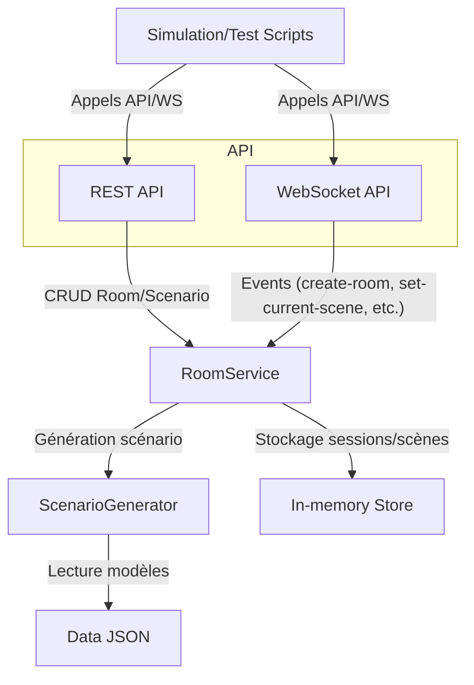

# Architecture Backend

Ce diagramme présente les principaux composants du backend et leurs interactions.

```mermaid
flowchart TD
    subgraph API
        A1[REST API]
        A2[WebSocket API]
    end
    B[RoomService]
    C[ScenarioGenerator]
    D[In-memory Store]
    E[Data JSON]
    F[Simulation/Test Scripts]

    A1 -- CRUD Room/Scenario --> B
    A2 -- Events (create-room, set-current-scene, etc.) --> B
    B -- Génération scénario --> C
    C -- Lecture modèles --> E
    B -- Stockage sessions/scènes --> D
    F -- Appels API/WS --> A1
    F -- Appels API/WS --> A2
```
