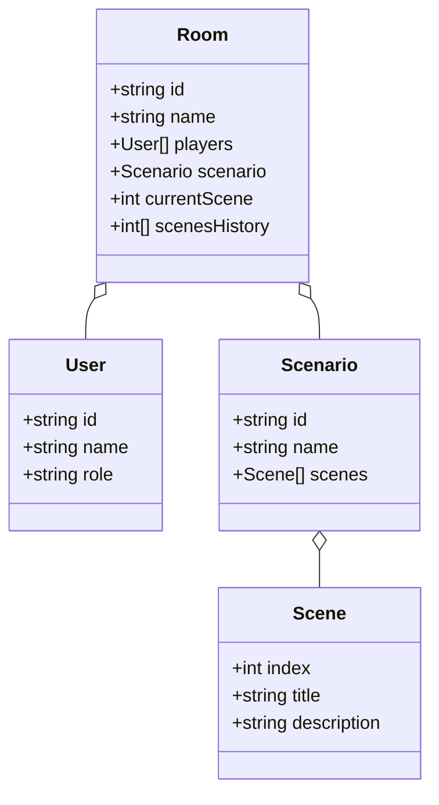

# Diagramme de classes (Backend)

Diagramme Mermaid simplifié des principales classes backend.

```mermaid
classDiagram
    class Room {
        +string id
        +string name
        +User[] players
        +Scenario scenario
        +int currentScene
        +int[] scenesHistory
    }
    class User {
        +string id
        +string name
        +string role
    }
    class Scenario {
        +string id
        +string name
        +Scene[] scenes
    }
    class Scene {
        +int index
        +string title
        +string description
    }
    Room o-- User
    Room o-- Scenario
    Scenario o-- Scene
```
