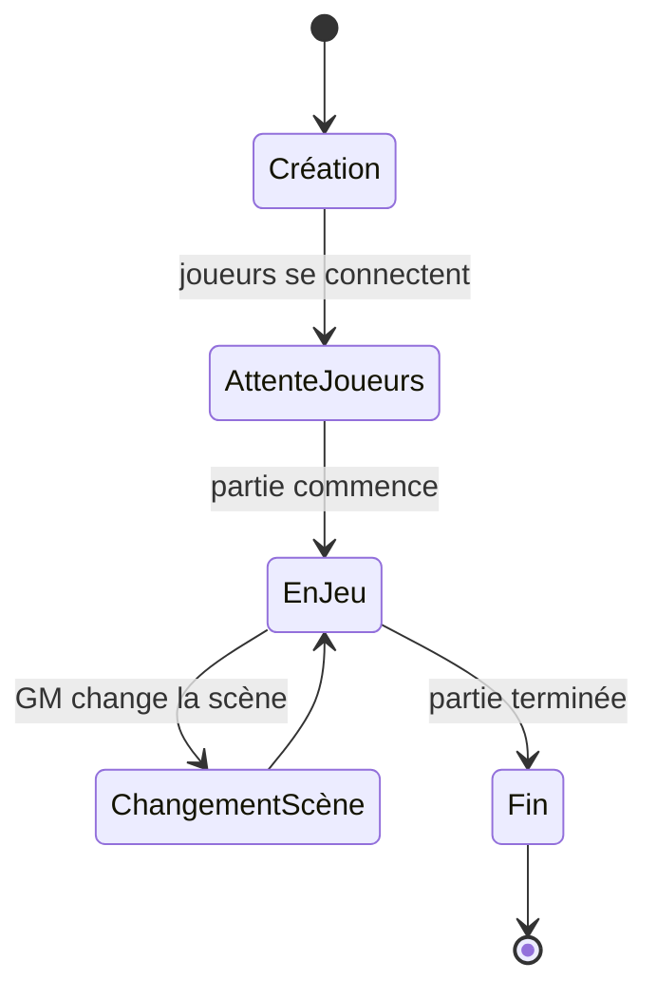

# Cycle de vie d'une Room

Diagramme d'état représentant le cycle de vie d'une session de jeu (Room).

```mermaid
stateDiagram-v2
    [*] --> Création
    Création --> AttenteJoueurs: joueurs se connectent
    AttenteJoueurs --> EnJeu: partie commence
    EnJeu --> ChangementScène: GM change la scène
    ChangementScène --> EnJeu
    EnJeu --> Fin: partie terminée
    Fin --> [*]
```
