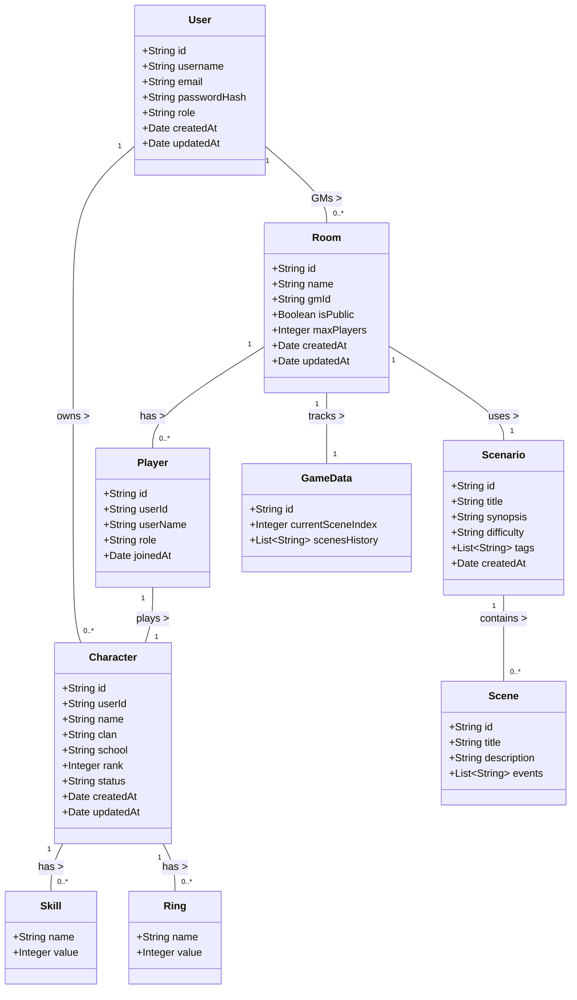

```mermaid

classDiagram
    class User {
        +String id
        +String username
        +String email
        +String passwordHash
        +String role
        +Date createdAt
        +Date updatedAt
    }

    class Character {
        +String id
        +String userId
        +String name
        +String clan
        +String school
        +Integer rank
        +String status
        +Date createdAt
        +Date updatedAt
    }

    class Room {
        +String id
        +String name
        +String gmId
        +Boolean isPublic
        +Integer maxPlayers
        +Date createdAt
        +Date updatedAt
    }

    class Player {
        +String id
        +String userId
        +String userName
        +String role
        +Date joinedAt
    }

    class Scenario {
        +String id
        +String title
        +String synopsis
        +String difficulty
        +List~String~ tags
        +Date createdAt
    }

    class Scene {
        +String id
        +String title
        +String description
        +List~String~ events
    }

    class GameData {
        +String id
        +Integer currentSceneIndex
        +List~String~ scenesHistory
    }

    class Skill {
        +String name
        +Integer value
    }

    class Ring {
        +String name
        +Integer value
    }

    User "1" -- "0..*" Character : owns >
    User "1" -- "0..*" Room : GMs >
    Room "1" -- "0..*" Player : has >
    Player "1" -- "1" Character : plays >
    Room "1" -- "1" Scenario : uses >
    Scenario "1" -- "0..*" Scene : contains >
    Room "1" -- "1" GameData : tracks >
    Character "1" -- "0..*" Skill : has >
    Character "1" -- "0..*" Ring : has >
```