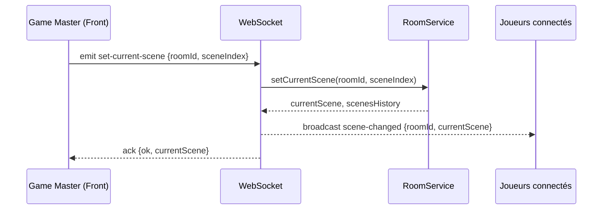

# Flux de changement de scène

Ce diagramme illustre comment le GM change la scène courante d'une room et comment l'information est diffusée aux joueurs.

```mermaid
sequenceDiagram
    participant GM as Game Master (Front)
    participant WS as WebSocket
    participant RoomService
    participant Players as Joueurs connectés

    GM->>WS: emit set-current-scene {roomId, sceneIndex}
    WS->>RoomService: setCurrentScene(roomId, sceneIndex)
    RoomService-->>WS: currentScene, scenesHistory
    WS-->>Players: broadcast scene-changed {roomId, currentScene}
    WS-->>GM: ack {ok, currentScene}
```
