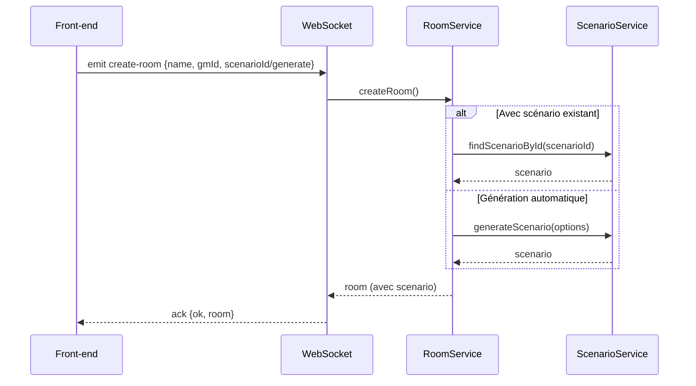

# Flux de création de session de jeu

Ce diagramme montre comment une session de jeu (room) est créée avec ou sans scénario.

```mermaid
sequenceDiagram
    participant Front as Front-end
    participant WS as WebSocket
    participant RoomService
    participant ScenarioService

    Front->>WS: emit create-room {name, gmId, scenarioId/generate}
    WS->>RoomService: createRoom()
    alt Avec scénario existant
        RoomService->>ScenarioService: findScenarioById(scenarioId)
        ScenarioService-->>RoomService: scenario
    else Génération automatique
        RoomService->>ScenarioService: generateScenario(options)
        ScenarioService-->>RoomService: scenario
    end
    RoomService-->>WS: room (avec scenario)
    WS-->>Front: ack {ok, room}
```
